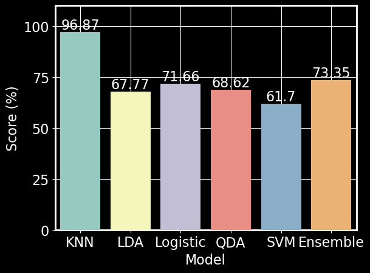

We set out to create a classifier that would perform very well (>90% accuracy) on the forest cover type data set from University of California Irvine Machine Learning Repository. 

The forest cover type data set contains 581012 instances of 54 cartographic predictors with 7 classes. These predictors area mix of continous and categorical data and the 7 classes refer to various different cover types (i.e., most prominent tree in the area). 

In order to create a high performing model, we used ensemble learning. Ensemble learning refers to combining multiple models to create the strongest prediction possible. Our ensemble model cotained 5 sub models ($$K$$ Nearest Neighbors, Support Vector Machine, Linear Discriminant Analysis, Quadratic Discriminant Analysis, and Logistic Regression). We used 10 fold cross-validation to find local minimum of each of these sub model parameters. Once we found optimal parameters, we trained these models and had them predict forest cover type. 

  

We found that we had some moderate classifiers (i.e., Linear Discriminant Analysis, Quadratic Discriminant Analysis, and Logistic Regression) and some strong classifiers (i.e., $$K$$ Nearest Neighbors and Support Vector Machine). Interestingly, our ensemble model perfomed better than the moderate classifiers, but worse than the strong classifiers. 

Take a look at the rest of the website to find out more!
