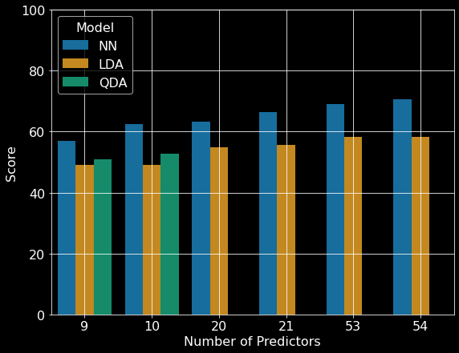
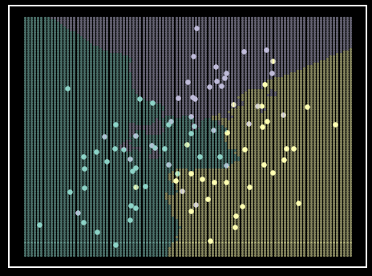

# What's covering me? - Prediction of forest cover type based on cartographic variables

Devin Austin and Duncan Tulimieri

Table of Contents

1. [Introduction](#introduction)

    1. [Previous literature using forest cover type data set](#previous-literature-using-forest-cover-type-data-set)
    
      1. [Blackard and Dean (1999)](#blackard-and-dean-1999)
      
      2. [Oza and Russell (2001)](#oza-and-russell-2001)
      
2. [Algorithms](#algorithms)

    1. [$$K$$-Nearest Neighbors ($$K$$NN)](#k-nearest-neighbors-knn)
  
    2. [Support Vector Machine (SVM)](#support-vector-machine-svm)
  
    3. [Linear Discriminant Analysis (LDA)](#linear-discriminant-analysis-lda)
  
    4. [Quadratic Discriminant Analysis (QDA)](#quadratic-discriminant-analysis-qda)
  
    5. [Logistic Regression (LR)](#logistic-regression-lr)
  
    6. [Ensemble Learning](#ensemble-learning)
  
3. [Results](#results)   

    1. [$$K$$-Nearest Neighbors](#k-nearest-neighbors)
  
    2. [Support Vector Machine](#support-vector-machine)
  
    3. [Linear Discriminant Analysis](#linear-discriminant-analysis)
  
    4. [Quadratic Discriminant Analysis](#quadratic-discriminant-analysis)
  
    5. [Logistic Regression](#logistic-regression)
  
    6. [Ensemble](#ensemble)
  
4. [Discussion](#discussion)

    1. [Moderate performers](#moderate-performers)
  
    2. [Strong performer](#strong-performer)
  
    3. [What happened with the ensemble model?](#what-happened-with-the-ensemble-model)
  
    4. [Future directions](#future-directions)
  
5. [Conclusion](#conclusion)

6. [Replication](#replication)

7. [Acknowledgements](#acknowledgements)

8. [References](#references)

---

# Introduction
National parks are some of the most beautiful places on this little blue planet we call home. They are some of the only remaining "untouched" regions of Earth that allow nature to flourish. These parks, while untouched, are not ignored. In fact, they are some of the most studied regions around the world.

The University of California Irvine's machine learning repository contains a large data set on the Roosevelt National Forest in northern Colorado. This data set -- known as the forest cover type data set -- is comprised of cartographic information from four parks within the Roosevelt National Forest (e.g Rawah, Comanche Peak, Neota, and Cache la Poudre) (Figure \ref{fig:loc_map}). The data set contains a variety of continuous and categorical features obtained from geological surveys; including elevation, soil type, slope, hill shade at various times of day, and distance to the nearest body of water. Along with these features, each instance has a forest cover type classification, which refers to the predominant tree species in a given 30x30 meter region (Figure \ref{fig:forest_cover_types}).

Current methods for classifying forest cover types involve direct observations via field personnel or estimation using remotely sensed data \cite{blackard1999comparative}. These approaches are often time-consuming and costly; however, the use of predictive models can streamline this process \cite{blackard1999comparative}. We decided to examine the accuracies of several machine learning algorithms and an ensemble learning method to predict forest cover types. Using these methods, our goal was to achieve the highest predictive power across all classes.

  

Figure 1. Study area location map. Taken from Blackard and Dean (1999) \cite{blackard1999comparative}.

  

Figure 2. Forest cover types and predictors. The data set contains 581,012 instances, 54 predictors, and 7 classes. Examples of the seven cover type classifications can be seen in the pictures \cite{Spruce},\cite{Cottonwood},\cite{Krumholz},\cite{LodgepolePine},\cite{Aspen},\cite{PonderosaPine},\cite{DouglasFir}. A condensed list of predictors can be seen in bottom right.

## Previous literature using forest cover type data set

### Blackard and Dean (1999)
Blackard and Dean were the first to publish on this data set \cite{blackard1999comparative}. These authors compared the performance of a neural network, a linear discriminant analysis model, and a quadratic discriminant analysis model on multiple subsets of the data set. The authors split the data set into six subsets (Table \ref{tab:BD99_subsetTable}). These subsets were chosen because the authors had \textit{a priori} ideas about which predictors would hold large predictive power and wished to test these hypotheses. 

| Number of independent variables |  Description of variables |
| ------------------------------- | ------------------------- |
| 9 | Same as '10' but excluding distance-to-wildfire-ignition-points |
| 10 | Ten quantitative variables only | 
| 20 | Same as '21' but excluding distance-to-wildfire-ignition-points |
| 21 | Ten quantitative variables + 11 generalized soil types |
| 53 | Same as '54' but excluding distance-to-wildfire-ignition-points |
| 54 | Ten quantitative variables + four wilderness areas + 40 soil types |

Table 1. Number of input variable subsets examined. Taken from Blackard and Dean (1999) \cite{blackard1999comparative}.

To train the best neural network, the authors did multiple iterations of editing model parameters \cite{blackard1999comparative}. The neural network was initialized and kept to one input layer, one hidden layer, and one output layer. These layers were dense with no dropouts. The authors systematically changed the number of nodes in the hidden layer to determine the best learning and momentum rates. To update the weights, the neural network used back propagation. The weights for this model were initialized by randomly sampling from a uniform distribution between negative and positive one. The activation functions for the hidden layers were linear, while the activation function for the output layers were logistic. After the authors found an optimal set of parameters, they verified these parameters were optimal by creating thirty new neural networks with randomized initial synaptic weights. The authors state this process was used to ensure the weight space was fully explored due to the stochastic nature of initializing weights. After parameter tuning, a neural network with 54 input nodes, 120 hidden layer nodes, 7 output nodes, a learning rate of 0.05, and a momentum rate of 0.5 was determined to be optimal. This neural network had the highest classification accuracy of 70.58\% with all 54 predictors (Figure \ref{fig:BB99_comp_models}). 

The authors also implemented both linear and quadratic discriminant analyses, which required less parameter tuning than neural networks, but at the cost of flexibility \cite{blackard1999comparative}. The quadratic discriminant analysis model was able to make predictions on subsets that did not contain categorical features and became unstable upon their addition. Of the subsets of data tested, the linear discriminant analysis model had the highest classification accuracy (\textasciitilde 58.38\%) with all 54 predictors (Figure \ref{fig:BB99_comp_models}). The quadratic discriminant analysis model achieved its highest classification accuracy (\textasciitilde 49.15\%) with 10 predictors (Figure \ref{fig:BB99_comp_models}).

Overall, the authors were able to create a model that predicted the forest cover type well. All the models tested were able to perform better than chance (14\%) (Figure \ref{fig:BB99_comp_models}). The neural network achieved the highest overall accuracy (\textasciitilde 71\%) when the model included all the variables. As expected, the neural network showed a steady increase in accuracy as more predictors were added. Additionally, the discriminant analyses also showed an increase in accuracy as more predictors were added. 

The authors pose many reasons the neural network outperformed the discriminant analyses. One potential reason for this discrepancy could have been due to the underlying assumptions of the discriminant analysis models. Linear discriminant analysis models each class as a multivariate Gaussian distribution and assumes all classes share a covariance matrix. On the other hand, quadratic discriminant analysis models assume each class is normally distributed and that each class has its own covariance matrix. A neural network has no assumptions about the underlying distributions and therefore will be most flexible in modeling data. The authors state that another reason the discriminant analyses could have performed worse than neural networks was due to the non-linearity of the data. Discriminant analyses perform well with linear data while neural networks are flexible in regards to the linearity of the data. On the other hand, one area where the discriminant analyses outperformed the neural network was in computational time. The discriminant analyses took only 5 hours to run, while the neural network, once finalized, took 45 hours to finalize. The 45 hour run time of the neural network also did not take into account the time needed for the operator to manually tune all the hyper parameters. 

  

Figure 3. Comparison of artificial neural network and discriminant analysis classification results. \textit{NN}: neural network, \textit{LDA}: linear discriminant analysis; \textit{QDA} quadratic discriminant analysis. Republished from Blackard and Dean (1999) \cite{blackard1999comparative}.
      
### Oza and Russell (2001)
In 2001, Oza and Russell utilized the forest cover type data set as one of many large data sets to validate alternative versions of traditional ensemble learning algorithms \cite{oza2001experimental}. Ensemble learning utilize multiple machine learning techniques that are combined to achieve an improved predictive performance. Many of these algorithms involve the use of weights, which mediate the occurrence of observations during resampling. 

One example of weighted ensemble learning is bagging, which traditionally trains several models, each with randomly re-sampled subsets of data, and combines their predictions. The authors created an online version of bagging that assigns weights to each sample to mediate occurrences during re-sampling \cite{oza2001experimental}. Another example of weighted ensemble learning is boosting, which sequentially retrains a single model based on the errors of previous iterations. While traditional boosting updates weights based on performance on the entire training data set, online boosting updates weights using only samples the model has seen before \cite{oza2001experimental}. For example, if the first iteration only uses 100 unique samples, the testing set for this model will only be those 100 instances. If the next iteration of model training observes 50 more unique samples, then the testing set for this model will be updated to include those 50 new instances. The authors report that early iterations had relatively poor performance; however, as the iterations increased, so did the model's accuracy. The authors also note that accuracy was similar between traditional and online versions of both ensemble techniques despite the online versions having significantly shorter computation times. The authors report that ensemble learning techniques were effective when applied to the forest cover type data set, but unfortunately no model scores were reported. 
      
# Algorithms

## $$K$$-Nearest Neighbors ($$K$$NN)
$K$-Nearest Neighbors ($K$NN) is a powerful method for classification. $K$NN classifies based on the $k$ closest neighbors. The $k$ parameter determines how many of the closest observations are considered when classifying a given sample (Algorithm \ref{algo:KNN}). For example, if $k$ is equal to three, then the algorithm will consider the three closest training observations to the test instance and predict the classification of the new instance based on a majority vote of the three closest training observations (Figure \ref{fig:KNN_Hastie}). Another parameter commonly given to $K$NN is the method for applying weights to each neighbor's vote during classification. A common technique is to base the weights on the distances between observations, with closer observations having a "stronger" vote. The weights can be determined by the inverse of the distance between observations, so closer instances have a "stronger" vote during classification (Algorithm \ref{algo:KNN}).

  

Figure 4. $K$NN classifier on simulated data. Each class is represented by a single color. Shaded regions represent class prediction in the area. Inspiration from Hastie et al. - \textit{Elements of Statistical Learning} \cite{hastie2009elements}.

\begin{algorithm}
    \textbf{Input:} $X_{train}$, $y_{train}$, $X_{test}$, $k$ \newline
    \textbf{Output:} Predictions \newline
    \Begin{
        \For{i, x in enumerate($X_{test}$)} {
            distances = calculate distance between $x$ and $X_{train}$ \newline
            neighbors = $k$ instances of $X_{train}$ with smallest distances
            \newline
            class\_weights = calculate class ($y_{train}$) weights ($\frac{1}{distance}$) for neighbors \newline
            Predictions[i] = class with highest class\_weights
        }
    }
    \caption{$K$-Nearest Neighbors}
    \label{algo:KNN}
\end{algorithm}
  
## Support Vector Machine (SVM)
  
## Linear Discriminant Analysis (LDA)
  
## Quadratic Discriminant Analysis (QDA)
  
## Logistic Regression (LR)
  
## Ensemble Learning
  
# Results  

## $$K$$-Nearest Neighbors
  
## Support Vector Machine
  
## Linear Discriminant Analysis
  
## Quadratic Discriminant Analysis
  
## Logistic Regression
  
## Ensemble
  
# Discussion

## Moderate performers
  
## Strong performer
  
## What happened with the ensemble model?
  
## Future directions
  
# Conclusion

# Replication

# Acknowledgements

# References
