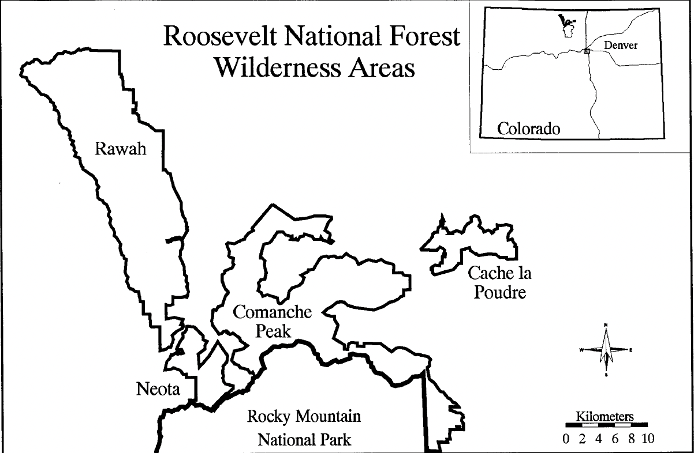

# What's covering me? - Prediction of forest cover type based on cartographic variables

Devin Austin and Duncan Tulimieri

Table of Contents

1. [Introduction](#introduction)

    1. [Previous literature using forest cover type data set](#previous-literature-using-forest-cover-type-data-set)
    
      1. [Blackard and Dean (1999)](#blackard-and-dean-1999)
      
      2. [Oza and Russell (2001)](#oza-and-russell-2001)
      
2. [Algorithms](#algorithms)

    1. [$$K$$-Nearest Neighbors ($$K$$NN)](#k-nearest-neighbors-knn)
  
    2. [Support Vector Machine (SVM)](#support-vector-machine-svm)
  
    3. [Linear Discriminant Analysis (LDA)](#linear-discriminant-analysis-lda)
  
    4. [Quadratic Discriminant Analysis (QDA)](#quadratic-discriminant-analysis-qda)
  
    5. [Logistic Regression (LR)](#logistic-regression-lr)
  
    6. [Ensemble Learning](#ensemble-learning)
  
3. [Results](#results)   

    1. [$$K$$-Nearest Neighbors](#k-nearest-neighbors)
  
    2. [Support Vector Machine](#support-vector-machine)
  
    3. [Linear Discriminant Analysis](#linear-discriminant-analysis)
  
    4. [Quadratic Discriminant Analysis](#quadratic-discriminant-analysis)
  
    5. [Logistic Regression](#logistic-regression)
  
    6. [Ensemble](#ensemble)
  
4. [Discussion](#discussion)

    1. [Moderate performers](#moderate-performers)
  
    2. [Strong performer](#strong-performer)
  
    3. [What happened with the ensemble model?](#what-happened-with-the-ensemble-model)
  
    4. [Future directions](#future-directions)
  
5. [Conclusion](#conclusion)

6. [Replication](#replication)

7. [Acknowledgements](#acknowledgements)

8. [References](#references)

---

# Introduction

National parks are some of the most beautiful places on this little blue
planet we call home. They are some of the only remaining \"untouched\"
regions of Earth that allow nature to flourish. These parks, while
untouched, are not ignored. In fact, they are some of the most studied
regions around the world.

The University of California Irvine's machine learning repository
contains a large data set on the Roosevelt National Forest in northern
Colorado. This data set -- known as the forest cover type data set -- is
comprised of cartographic information from four parks within the
Roosevelt National Forest (e.g Rawah, Comanche Peak, Neota, and Cache la
Poudre) (Figure [1]). The data set contains a variety of continuous
and categorical features obtained from geological surveys; including
elevation, soil type, slope, hill shade at various times of day, and
distance to the nearest body of water. Along with these features, each
instance has a forest cover type classification, which refers to the
predominant tree species in a given 30x30 meter region (Figure
[[2]](#fig:forest_cover_types){reference-type="ref"
reference="fig:forest_cover_types"}).

Current methods for classifying forest cover types involve direct
observations via field personnel or estimation using remotely sensed
data [[2]](#references). These approaches are
often time-consuming and costly; however, the use of predictive models
can streamline this process [[2]](#references). We
decided to examine the accuracies of several machine learning algorithms
and an ensemble learning method to predict forest cover types. Using
these methods, our goal was to achieve the highest predictive power
across all classes.

 Figure 1. Study area location map. Taken from Blackard and Dean (1999) [[2]](#references).

![Forest cover types and predictors. The data set contains 581,012
instances, 54 predictors, and 7 classes. Examples of the seven cover
type classifications can be seen in the pictures
[[14]](#references),[[13]](#references),[[7]](#references),[[15]](#references),[[3]](#references),[[1]](#references),[[5]](#references).
A condensed list of predictors can be seen in bottom right.
](figures/Forest_Covers_kbg.png){#fig:forest_cover_types}

## Previous literature using forest cover type data set

### Blackard and Dean (1999) [[2]](#references)

Blackard and Dean were the first to publish on this data set
[[2]](#references). These authors compared the
performance of a neural network, a linear discriminant analysis model,
and a quadratic discriminant analysis model on multiple subsets of the
data set. The authors split the data set into six subsets (Table
[[1]](#tab:BD99_subsetTable){reference-type="ref"
reference="tab:BD99_subsetTable"}). These subsets were chosen because
the authors had *a priori* ideas about which predictors would hold large
predictive power and wished to test these hypotheses.

::: {#tab:BD99_subsetTable}
   Number of independent variables                        Description of variables
  --------------------------------- --------------------------------------------------------------------
                  9                   Same as '10' but excluding distance-to-wildfire-ignition-points
                 10                                   Ten quantitative variables only
                 20                   Same as '21' but excluding distance-to-wildfire-ignition-points
                 21                        Ten quantitative variables + 11 generalized soil types
                 53                   Same as '54' but excluding distance-to-wildfire-ignition-points
                 54                  Ten quantitative variables + four wilderness areas + 40 soil types

  : Number of input variable subsets examined. Taken from Blackard and
  Dean (1999) [[2]](#references).
:::

To train the best neural network, the authors did multiple iterations of
editing model parameters [[2]](#references). The
neural network was initialized and kept to one input layer, one hidden
layer, and one output layer. These layers were dense with no dropouts.
The authors systematically changed the number of nodes in the hidden
layer to determine the best learning and momentum rates. To update the
weights, the neural network used back propagation. The weights for this
model were initialized by randomly sampling from a uniform distribution
between negative and positive one. The activation functions for the
hidden layers were linear, while the activation function for the output
layers were logistic. After the authors found an optimal set of
parameters, they verified these parameters were optimal by creating
thirty new neural networks with randomized initial synaptic weights. The
authors state this process was used to ensure the weight space was fully
explored due to the stochastic nature of initializing weights. After
parameter tuning, a neural network with 54 input nodes, 120 hidden layer
nodes, 7 output nodes, a learning rate of 0.05, and a momentum rate of
0.5 was determined to be optimal. This neural network had the highest
classification accuracy of 70.58% with all 54 predictors (Figure
[[3]](#fig:BB99_comp_models){reference-type="ref"
reference="fig:BB99_comp_models"}).

The authors also implemented both linear and quadratic discriminant
analyses, which required less parameter tuning than neural networks, but
at the cost of flexibility [[2]](#references). The
quadratic discriminant analysis model was able to make predictions on
subsets that did not contain categorical features and became unstable
upon their addition. Of the subsets of data tested, the linear
discriminant analysis model had the highest classification accuracy
(\~58.38%) with all 54 predictors (Figure
[[3]](#fig:BB99_comp_models){reference-type="ref"
reference="fig:BB99_comp_models"}). The quadratic discriminant analysis
model achieved its highest classification accuracy (\~49.15%) with 10
predictors (Figure [[3]](#fig:BB99_comp_models){reference-type="ref"
reference="fig:BB99_comp_models"}).

Overall, the authors were able to create a model that predicted the
forest cover type well. All the models tested were able to perform
better than chance (14%) (Figure
[[3]](#fig:BB99_comp_models){reference-type="ref"
reference="fig:BB99_comp_models"}). The neural network achieved the
highest overall accuracy (\~71%) when the model included all the
variables. As expected, the neural network showed a steady increase in
accuracy as more predictors were added. Additionally, the discriminant
analyses also showed an increase in accuracy as more predictors were
added.

The authors pose many reasons the neural network outperformed the
discriminant analyses. One potential reason for this discrepancy could
have been due to the underlying assumptions of the discriminant analysis
models. Linear discriminant analysis models each class as a multivariate
Gaussian distribution and assumes all classes share a covariance matrix.
On the other hand, quadratic discriminant analysis models assume each
class is normally distributed and that each class has its own covariance
matrix. A neural network has no assumptions about the underlying
distributions and therefore will be most flexible in modeling data. The
authors state that another reason the discriminant analyses could have
performed worse than neural networks was due to the non-linearity of the
data. Discriminant analyses perform well with linear data while neural
networks are flexible in regards to the linearity of the data. On the
other hand, one area where the discriminant analyses outperformed the
neural network was in computational time. The discriminant analyses took
only 5 hours to run, while the neural network, once finalized, took 45
hours to finalize. The 45 hour run time of the neural network also did
not take into account the time needed for the operator to manually tune
all the hyper parameters.

![Comparison of artificial neural network and discriminant analysis
classification results. *NN*: neural network, *LDA*: linear discriminant
analysis; *QDA* quadratic discriminant analysis. Republished from
Blackard and Dean (1999)
[[2]](#references).](figures/BD_fig4_kbg.png){#fig:BB99_comp_models}

### Oza and Russell (2001) [[8]](#references)

In 2001, Oza and Russell utilized the forest cover type data set as one
of many large data sets to validate alternative versions of traditional
ensemble learning algorithms [[8]](#references).
Ensemble learning utilize multiple machine learning techniques that are
combined to achieve an improved predictive performance. Many of these
algorithms involve the use of weights, which mediate the occurrence of
observations during resampling.

One example of weighted ensemble learning is bagging, which
traditionally trains several models, each with randomly re-sampled
subsets of data, and combines their predictions. The authors created an
online version of bagging that assigns weights to each sample to mediate
occurrences during re-sampling [[8]](#references).
Another example of weighted ensemble learning is boosting, which
sequentially retrains a single model based on the errors of previous
iterations. While traditional boosting updates weights based on
performance on the entire training data set, online boosting updates
weights using only samples the model has seen before
[[8]](#references). For example, if the first
iteration only uses 100 unique samples, the testing set for this model
will only be those 100 instances. If the next iteration of model
training observes 50 more unique samples, then the testing set for this
model will be updated to include those 50 new instances. The authors
report that early iterations had relatively poor performance; however,
as the iterations increased, so did the model's accuracy. The authors
also note that accuracy was similar between traditional and online
versions of both ensemble techniques despite the online versions having
significantly shorter computation times. The authors report that
ensemble learning techniques were effective when applied to the forest
cover type data set, but unfortunately no model scores were reported.

# Algorithms

## $K$-Nearest Neighbors ($K$NN)

$K$-Nearest Neighbors ($K$NN) is a powerful method for classification.
$K$NN classifies based on the $k$ closest neighbors. The $k$ parameter
determines how many of the closest observations are considered when
classifying a given sample (Algorithm
[\[algo:KNN\]](#algo:KNN){reference-type="ref" reference="algo:KNN"}).
For example, if $k$ is equal to three, then the algorithm will consider
the three closest training observations to the test instance and predict
the classification of the new instance based on a majority vote of the
three closest training observations (Figure
[[4]](#fig:KNN_Hastie){reference-type="ref" reference="fig:KNN_Hastie"}).
Another parameter commonly given to $K$NN is the method for applying
weights to each neighbor's vote during classification. A common
technique is to base the weights on the distances between observations,
with closer observations having a \"stronger\" vote. The weights can be
determined by the inverse of the distance between observations, so
closer instances have a \"stronger\" vote during classification
(Algorithm [\[algo:KNN\]](#algo:KNN){reference-type="ref"
reference="algo:KNN"}).

![$K$NN classifier on simulated data. Each class is represented by a
single color. Shaded regions represent class prediction in the area.
Inspiration from Hastie et al. - *Elements of Statistical Learning*
[[6]](#references).](figures/KNN_Example_kbg.png){#fig:KNN_Hastie}

::: algorithm
**Input:** $X_{train}$, $y_{train}$, $X_{test}$, $k$ **Output:**
Predictions
:::

## Support Vector Machine (SVM)

Support vector machine (SVM) is a commonly used machine learning
algorithm. This algorithm attempts to find a hyperplane that can
distinctively split classes by maximizing the margin between the closest
observations between classes. The instances used to create the
hyperplane are known as the support vectors and can consist of samples
both at the edge and within a given class of training data. The
hyperplane itself acts as a boundary between observations that can then
be used to classify new instances (Figure
[[5]](#fig:SVM_Hastie){reference-type="ref" reference="fig:SVM_Hastie"},
Algorithm [\[algo:SVM\]](#algo:SVM){reference-type="ref"
reference="algo:SVM"}). One of the strengths of SVM is that it can
account for some degree of misclassification by establishing a buffer
region around the hyperplane. When establishing the hyperplane, SVM
ignores misclassifications within this region to find an optimal
decision boundary. Another strength of SVM is that it can use is a
kernel. A kernel will transform the data into a different space with the
goal of more effectively separating the classes.

![SVM classifier on simulated data. Each class is represented by a
single color. Shaded regions represent class prediction in the area.
Inspiration from Hastie et al. - *Elements of Statistical Learning*
[[6]](#references).](figures/SVM_Example_kbg.png){#fig:SVM_Hastie}

::: algorithm
**Input:** $X_{train}$, $X_{test}$, $C$, $Kernel$ **Output:**
Predictions
:::

## Linear Discriminant Analysis (LDA)

Linear discriminant analysis (LDA) is another good method for
classifying data; that is, when the assumptions of the model hold true.
LDA assumes that all the predictors are normally distributed. Naturally,
this algorithm models the data as a multivariate Gaussian (Algorithm
[\[algo:LDA\]](#algo:LDA){reference-type="ref" reference="algo:LDA"}).
More specifically, each class has a mean ($\mu$) vector for all
predictors, but each class does not have their own covariance ($\Sigma$)
matrix. Instead, all classes are assumed to share a $\Sigma$ matrix.
These assumptions can reasonably model data when there is enough to
obtain an estimate of central tendency, but not enough to get a stable
estimate of dispersion within predictors and correlation between
predictors (Figure [[6]](#fig:LDA_Hastie){reference-type="ref"
reference="fig:LDA_Hastie"}).

Like all models, LDA will perform poorly if the assumptions are
violated. For example, if most features are normally distributed but a
powerful predictor has a Poisson distribution, its predictive power will
go to waste because it is being poorly modeled. While the previous
example can be fixed by scaling the differently distributed predictor,
this algorithm has no way to account for each class having a different
covariance matrix.

![LDA classifier on simulated data. Each class is represented by a
single color. Each class's simulated data comes from a unique $\mu$
vector with a shared $\Sigma$ matrix, therefore not violating the LDA
assumptions. Shaded regions represent class prediction in the area.
Inspiration from Hastie et al. - *Elements of Statistical Learning*
[[6]](#references).](figures/LDA_Example_kbg.png){#fig:LDA_Hastie}

::: algorithm
**Input:** $X_{train}$, $y_{train}$, $X_{test}$ **Output:** Predictions
Let $Classes$ be the unique numeric classes in $y_{train}$
:::

## Quadratic Discriminant Analysis (QDA)

Quadratic discriminant analysis (QDA) is another algorithm for
classifying data, and is more flexible in how it models data compared to
LDA. Both LDA and QDA model central tendency the same, with a $\mu$
vector for each class, but model within and between dispersion
($\Sigma$) differently. Whereas LDA models $\Sigma$ for all classes
together, QDA will model $\Sigma$ for each class separately (Algorithm
[\[algo:QDA\]](#algo:QDA){reference-type="ref" reference="algo:QDA"}).
This small difference will allow this algorithm more flexibility around
classes having different relationships between and within predictors
(Figure [[7]](#fig:QDA_Hastie){reference-type="ref"
reference="fig:QDA_Hastie"}). However, there must be enough data in each
class to allow reasonable estimation of within and between dispersion.
If not, QDA will suffer and LDA may be the stronger model.

![QDA classifier on simulated data. Each class is represented by a
single color. Each classes simulated data comes from a multivariate
Gaussian with a unique $\mu$ vector and $\Sigma$ matrix. Shaded regions
represent class prediction in the area. Inspiration from Hastie et al. -
*Elements of Statistical Learning*
[[6]](#references).](figures/QDA_Example_kbg.png){#fig:QDA_Hastie}

::: algorithm
**Input:** $X_{train}$, $y_{train}$, $X_{test}$ **Output:** Predictions
Let $Classes$ be the unique classes in $y_{train}$
:::

## Logistic Regression

Logistic regression is a simple, yet effective, machine learning model
(Figure [[8]](#fig:LR_Hastie){reference-type="ref"
reference="fig:LR_Hastie"}). Whereas linear regression predicts
continuous values along a line, logistic regression predicts continuous
values along a sigmoid curve (such as a logistic function) (Algorithm
[\[algo:LR\]](#algo:LR){reference-type="ref" reference="algo:LR"}).
Prediction along a sigmoid curve allows for better classification than
along a line because the sigmoid function has more values at 0 and 1.
Therefore, for classification problems, logistic regression is commonly
preferred.

![Logistic regression classifier example. Each class is represented by a
single color. Shaded regions represent class prediction in the area.
Inspiration from Hastie et al. - *Elements of Statistical Learning*
[[6]](#references).](figures/LR_Example_kbg.png){#fig:LR_Hastie}

::: algorithm
**Input:** $X_{train}$, $X_{test}$ **Output:** Predictions Use an
optimizer, like Newton's method, to find optimal coefficients ($\beta$)
for a logistic model based on $X_{train}$.
:::

## Ensemble Learning

Ensemble learning is a technique that utilizes several models to
increase predictive performance. These models can be the same algorithm
with mutliple versions of the training data set (e.g. bagging); they can
be the same algorithm repeated with re-weighted samples of the training
set based on previous model performance (e.g. boosting); or they can be
several different algorithms that are trained on the same data.
Regardless, an ensemble model typically predicts via a majority vote.
For the latter example, utilizing several algorithms with their various
assumptions and biases allows algorithms to account for each other's
weaknesses. If the multiple assumptions and biases of each algorithm
produce a series of weak learners with poor performances, combining them
can produce a more stable and accurate prediction
[[10]](#references).

![Ensemble classifier on simulated data. Each class is represented by a
single color. The ensemble classifier is made from the previous models
trained on the simulated data (e.g., $K$NN \[Figure
[[4]](#fig:KNN_Hastie){reference-type="ref" reference="fig:KNN_Hastie"}\],
SVM \[Figure [[5]](#fig:SVM_Hastie){reference-type="ref"
reference="fig:SVM_Hastie"}\], LDA \[Figure
[[6]](#fig:LDA_Hastie){reference-type="ref" reference="fig:LDA_Hastie"}\],
QDA \[Figure [[7]](#fig:QDA_Hastie){reference-type="ref"
reference="fig:QDA_Hastie"}\], and Logistic Regression \[Figure
[[8]](#fig:LR_Hastie){reference-type="ref" reference="fig:LR_Hastie"}\])
with a majority vote for prediction. Shaded regions represent class
prediction in the area. Inspiration from Hastie et al. - *Elements of
Statistical Learning*
[[6]](#references).](figures/Ensemble_Example_kbg.png){#fig:Ensemble_Hastie}

::: algorithm
**Input:** $K$NN, SVM, LDA, QDA, Logistic Regression, $X_{test}$
**Output:** Predictions
:::

# Results

In order to assess how well our models performed we used multiple
performance metrics. Our first metric of performance was accuracy
(Equation [\[eq:avg_accuracy\]](#eq:avg_accuracy){reference-type="ref"
reference="eq:avg_accuracy"} [[9]](#references)). Accuracy
provided an overall idea of the model's performance. However, in
multi-class classification this can be a harsh way to measure true
accuracy [[9]](#references). Additionally, we used a
confusion matrix to better understand the accuracy of within and between
class predictions (Table
[[2]](#table:classification_confusion){reference-type="ref"
reference="table:classification_confusion"}, Equation
[\[eq:confusion_element\]](#eq:confusion_element){reference-type="ref"
reference="eq:confusion_element"}). A perfect multi-class classifier
would have a confusion matrix with 100% accuracy on the diagonal and 0%
accuracy everywhere else. On the other hand, a completely inaccurate
multi-class classifier would have a confusion matrix with 0% on the
diagonal and various percentages everywhere else.

$$accuracy(y,\hat{y}) = \frac{1}{n_{samples}} \Sigma_{i=0}^{n_{samples}-1} 1(\hat{y_i} = y_i)
    \label{eq:avg_accuracy}$$

$$confusion[i,j] = \frac{\Sigma1 (y_i = \hat{y_j})}{ \Sigma1 (y_i)}
    \label{eq:confusion_element}$$

::: center
::: {#table:classification_confusion}
+-------+-------+-------+-------+-------+-------+-------+-------+-------+
|       |       | Pred  |       |       |       |       |       |       |
|       |       | icted |       |       |       |       |       |       |
|       |       | Class |       |       |       |       |       |       |
+:======+:======+:======+:======+:======+:======+:======+:======+:======+
|       |       | $     | $     | $     | $     | $A_p$ | $     | $K_p$ |
|       |       | SF_p$ | LP_p$ | PP_p$ | CW_p$ |       | Df_p$ |       |
+-------+-------+-------+-------+-------+-------+-------+-------+-------+
| :::   | $     | $     | $     | $     | $     | $\fra | $     | $\fra |
|  turn | SF_A$ | \frac | \frac | \frac | \frac | c{\Si | \frac | c{\Si |
| 90A   |       | {\Sig | {\Sig | {\Sig | {\Sig | gma 1 | {\Sig | gma 1 |
| ctual |       | ma 1( | ma 1( | ma 1( | ma 1( | (SF_A | ma 1( | (SF_A |
| Class |       | SF_A  | SF_A  | SF_A  | SF_A  |  = A_ | SF_A  |  = K_ |
| :::   |       | = SF_ | = LP_ | = PP_ | = CW_ | p)}{\ | = Df_ | p)}{\ |
|       |       | p)}{\ | p)}{\ | p)}{\ | p)}{\ | Sigma | p)}{\ | Sigma |
|       |       | Sigma | Sigma | Sigma | Sigma |  1(SF | Sigma |  1(SF |
|       |       |  1(SF |  1(SF |  1(SF |  1(SF | _A)}$ |  1(SF | _A)}$ |
|       |       | _A)}$ | _A)}$ | _A)}$ | _A)}$ |       | _A)}$ |       |
+-------+-------+-------+-------+-------+-------+-------+-------+-------+
|       | $     | $     | $     | $     | $     | $\fra | $     | $\fra |
|       | LP_A$ | \frac | \frac | \frac | \frac | c{\Si | \frac | c{\Si |
|       |       | {\Sig | {\Sig | {\Sig | {\Sig | gma 1 | {\Sig | gma 1 |
|       |       | ma 1( | ma 1( | ma 1( | ma 1( | (LP_A | ma 1( | (LP_A |
|       |       | LP_A  | LP_A  | LP_A  | LP_A  |  = A_ | LP_A  |  = K_ |
|       |       | = SF_ | = LP_ | = PP_ | = CW_ | p)}{\ | = Df_ | p)}{\ |
|       |       | p)}{\ | p)}{\ | p)}{\ | p)}{\ | Sigma | p)}{\ | Sigma |
|       |       | Sigma | Sigma | Sigma | Sigma |  1(LP | Sigma |  1(LP |
|       |       |  1(LP |  1(LP |  1(LP |  1(LP | _A)}$ |  1(LP | _A)}$ |
|       |       | _A)}$ | _A)}$ | _A)}$ | _A)}$ |       | _A)}$ |       |
+-------+-------+-------+-------+-------+-------+-------+-------+-------+
|       | $     | $     | $     | $     | $     | $\fra | $     | $\fra |
|       | PP_A$ | \frac | \frac | \frac | \frac | c{\Si | \frac | c{\Si |
|       |       | {\Sig | {\Sig | {\Sig | {\Sig | gma 1 | {\Sig | gma 1 |
|       |       | ma 1( | ma 1( | ma 1( | ma 1( | (PP_A | ma 1( | (PP_A |
|       |       | PP_A  | PP_A  | PP_A  | PP_A  |  = A_ | PP_A  |  = K_ |
|       |       | = SF_ | = LP_ | = PP_ | = CW_ | p)}{\ | = Df_ | p)}{\ |
|       |       | p)}{\ | p)}{\ | p)}{\ | p)}{\ | Sigma | p)}{\ | Sigma |
|       |       | Sigma | Sigma | Sigma | Sigma |  1(PP | Sigma |  1(PP |
|       |       |  1(PP |  1(PP |  1(PP |  1(PP | _A)}$ |  1(PP | _A)}$ |
|       |       | _A)}$ | _A)}$ | _A)}$ | _A)}$ |       | _A)}$ |       |
+-------+-------+-------+-------+-------+-------+-------+-------+-------+
|       | $     | $     | $     | $     | $     | $\fra | $     | $\fra |
|       | CW_A$ | \frac | \frac | \frac | \frac | c{\Si | \frac | c{\Si |
|       |       | {\Sig | {\Sig | {\Sig | {\Sig | gma 1 | {\Sig | gma 1 |
|       |       | ma 1( | ma 1( | ma 1( | ma 1( | (CW_A | ma 1( | (CW_A |
|       |       | CW_A  | CW_A  | CW_A  | CW_A  |  = A_ | CW_A  |  = K_ |
|       |       | = SF_ | = LP_ | = PP_ | = CW_ | p)}{\ | = Df_ | p)}{\ |
|       |       | p)}{\ | p)}{\ | p)}{\ | p)}{\ | Sigma | p)}{\ | Sigma |
|       |       | Sigma | Sigma | Sigma | Sigma |  1(CW | Sigma |  1(CW |
|       |       |  1(CW |  1(CW |  1(CW |  1(CW | _A)}$ |  1(CW | _A)}$ |
|       |       | _A)}$ | _A)}$ | _A)}$ | _A)}$ |       | _A)}$ |       |
+-------+-------+-------+-------+-------+-------+-------+-------+-------+
|       | $A_A$ | $\fr  | $\fr  | $\fr  | $\fr  | $\f   | $\fr  | $\f   |
|       |       | ac{\S | ac{\S | ac{\S | ac{\S | rac{\ | ac{\S | rac{\ |
|       |       | igma  | igma  | igma  | igma  | Sigma | igma  | Sigma |
|       |       | 1(A_A | 1(A_A | 1(A_A | 1(A_A |  1(A_ | 1(A_A |  1(A_ |
|       |       |  = SF |  = LP |  = PP |  = CW | A = A |  = Df | A = K |
|       |       | _p)}{ | _p)}{ | _p)}{ | _p)}{ | _p)}{ | _p)}{ | _p)}{ |
|       |       | \Sigm | \Sigm | \Sigm | \Sigm | \Sigm | \Sigm | \Sigm |
|       |       | a 1(A | a 1(A | a 1(A | a 1(A | a 1(A | a 1(A | a 1(A |
|       |       | _A)}$ | _A)}$ | _A)}$ | _A)}$ | _A)}$ | _A)}$ | _A)}$ |
+-------+-------+-------+-------+-------+-------+-------+-------+-------+
|       | $     | $     | $     | $     | $     | $\fra | $     | $\fra |
|       | Df_A$ | \frac | \frac | \frac | \frac | c{\Si | \frac | c{\Si |
|       |       | {\Sig | {\Sig | {\Sig | {\Sig | gma 1 | {\Sig | gma 1 |
|       |       | ma 1( | ma 1( | ma 1( | ma 1( | (Df_A | ma 1( | (Df_A |
|       |       | Df_A  | Df_A  | Df_A  | Df_A  |  = A_ | Df_A  |  = K_ |
|       |       | = SF_ | = LP_ | = PP_ | = CW_ | p)}{\ | = Df_ | p)}{\ |
|       |       | p)}{\ | p)}{\ | p)}{\ | p)}{\ | Sigma | p)}{\ | Sigma |
|       |       | Sigma | Sigma | Sigma | Sigma |  1(Df | Sigma |  1(Df |
|       |       |  1(Df |  1(Df |  1(Df |  1(Df | _A)}$ |  1(Df | _A)}$ |
|       |       | _A)}$ | _A)}$ | _A)}$ | _A)}$ |       | _A)}$ |       |
+-------+-------+-------+-------+-------+-------+-------+-------+-------+
|       | $K_A$ | $\fr  | $\fr  | $\fr  | $\fr  | $\f   | $\fr  | $\f   |
|       |       | ac{\S | ac{\S | ac{\S | ac{\S | rac{\ | ac{\S | rac{\ |
|       |       | igma  | igma  | igma  | igma  | Sigma | igma  | Sigma |
|       |       | 1(K_A | 1(K_A | 1(K_A | 1(K_A |  1(K_ | 1(K_A |  1(K_ |
|       |       |  = SF |  = LP |  = PP |  = CW | A = A |  = Df | A = K |
|       |       | _p)}{ | _p)}{ | _p)}{ | _p)}{ | _p)}{ | _p)}{ | _p)}{ |
|       |       | \Sigm | \Sigm | \Sigm | \Sigm | \Sigm | \Sigm | \Sigm |
|       |       | a 1(K | a 1(K | a 1(K | a 1(K | a 1(K | a 1(K | a 1(K |
|       |       | _A)}$ | _A)}$ | _A)}$ | _A)}$ | _A)}$ | _A)}$ | _A)}$ |
+-------+-------+-------+-------+-------+-------+-------+-------+-------+

: Confusion matrix element calculations. Along the diagonal there are
the correct classification and elsewhere are the incorrect
classifications. Abbreviations: SF: Spruce/Fir, LP: Lodgepole Pine, PP:
Ponderosa Pine, CW: Cottonwood/Willow, A: Aspen, Df: Douglas-fir, K:
Krummholz, $X_A$: Actual X class, $X_P$: Predicted X class. The
calculation for an element can be seen in Equation
[\[eq:confusion_element\]](#eq:confusion_element){reference-type="ref"
reference="eq:confusion_element"}
:::

. []{#table:classification_confusion
label="table:classification_confusion"}
:::

![Model scores on test set. Scores were calculated according to Equation
[\[eq:avg_accuracy\]](#eq:avg_accuracy){reference-type="ref"
reference="eq:avg_accuracy"}. A threshold of 80% was used to determine
if a model was considered a strong (i.e., $K$NN) or moderate performer
(i.e., LDA, Logistic Regression, QDA, SVM,
Ensemble)](figures/all_models_scores_kbg.png){#fig:all_acc_bar}

## $K$-Nearest Neighbors

We used 10 fold cross-validation to determine the optimal number of
neighbors and the type of weight for our $K$NN model. We found that *5*
neighbors with a weight based on *distance* produced the best
performance with an accuracy of 96.87% (Figures
[[11]](#fig:KNN_params){reference-type="ref" reference="fig:KNN_params"} &
[[10]](#fig:all_acc_bar){reference-type="ref"
reference="fig:all_acc_bar"}). $K$NN was able to reliably predict a
majority of the forest cover types; however, the model repeatedly
confused Cottonwood/Willow with Ponderosa Pine or Douglas-fir (Figure
[[12]](#fig:KNN_confuse){reference-type="ref"
reference="fig:KNN_confuse"}).

{#fig:KNN_params}

![$K$NN confusion matrix. The predicted class is on the x-axis and the
actual class is on the y-axis. The color of each element is determined
by the relative accuracy of the predicted and actual combination to the
overall number of instances for the actual class (Equation
[\[eq:confusion_element\]](#eq:confusion_element){reference-type="ref"
reference="eq:confusion_element"}, Table
[[2]](#table:classification_confusion){reference-type="ref"
reference="table:classification_confusion"}).](figures/KNN_confusion_kbg.png){#fig:KNN_confuse}

## Support Vector Machine

After using a standard scaler on our predictors, we used 10 fold
cross-validation to determine the best kernel and regulating parameter
for the SVM model and found that a model with a *linear* kernel and a
regulating parameter of *8.684* produced the best performance (Figure
[[13]](#fig:SVM_params){reference-type="ref" reference="fig:SVM_params"}).
Due to time constraints, optimization of these parameters were performed
on a subset of the training data set. Our SVM model received an overall
accuracy of 61.70% (Figure [[10]](#fig:all_acc_bar){reference-type="ref"
reference="fig:all_acc_bar"}). Upon further examination of the SVM
confusion matrix, SVM misclassified every instance of Aspen and was only
able to strongly predict Lodgepole and Ponderosa Pine (Figure
[[14]](#fig:SVM_confuse){reference-type="ref"
reference="fig:SVM_confuse"}).

{#fig:SVM_params}

![SVM confusion matrix. The predicted class is on the x-axis and the
actual class is on the y-axis. The color (and value) of the elements are
calculated as found in Table
[[2]](#table:classification_confusion){reference-type="ref"
reference="table:classification_confusion"}.](figures/SVM_confusion_kbg.png){#fig:SVM_confuse}

## Linear Discriminant Analysis

We used 10 fold cross-validation to determine the best solver for a LDA
model and found that the *svd* solver performed best (Figure
[[15]](#fig:LDA_params){reference-type="ref" reference="fig:LDA_params"}).
Our LDA model with the *svd* solver achieved an overall accuracy of
67.77% (Figure [[10]](#fig:all_acc_bar){reference-type="ref"
reference="fig:all_acc_bar"}). We found that our LDA model had an easier
time predicting Spruce/Fir, Lodgepole Pine, and Krummholz than
predicting Ponderosa Pine, Cottonwood/Willow, Aspen, and Douglas-fir
(Figure [16](#fig:LDA_confuse){reference-type="ref"
reference="fig:LDA_confuse"}). It appears that our LDA model confused
Ponderosa Pines with almost exclusively Douglas-firs and conversely
confused Cottonwood/Willows with Ponderosa Pines. The model also seemed
to have confuse Douglas-firs for both Ponderosa and Lodgepole Pines.

![LDA parameter space. *svd* solver uses singular value decomposition;
*lsqr* solver uses least squares solution; *eigen* solver uses
eigenvalue decomposition
[[9]](#references).](figures/LDA_params_kbg.png){#fig:LDA_params}

![LDA confusion matrix. The predicted class is on the x-axis and the
actual class is on the y-axis. The color (and value) of the elements are
calculated as found in Table
[[2]](#table:classification_confusion){reference-type="ref"
reference="table:classification_confusion"}.](figures/LDA_confusion_kbg.png){#fig:LDA_confuse}

## Quadratic Discriminant Analysis

We used 10 fold cross-validation to determine the optimal parameters for
a QDA model and found that a regulating parameter of *0.14* performed
the best (Figure [17](#fig:QDA_params){reference-type="ref"
reference="fig:QDA_params"}). Our QDA model achieved an overall accuracy
of 68.82% (Figure [[10]](#fig:all_acc_bar){reference-type="ref"
reference="fig:all_acc_bar"}). We found that our QDA model had an easier
time predicting Spruce/Fir, Lodgepole Pine, Ponderosa Pine,
Cottonwood/Willow than predicting Aspen, Douglas-fir, and Krummholz
(Figure [18](#fig:QDA_confuse){reference-type="ref"
reference="fig:QDA_confuse"}). Our QDA model mistook Aspens for
Lodgepole Pines, Douglas-fir for Ponderosa Pines, and Krummholz for
Spruce/Fir.

![QDA parameter space. Regulating parameter refers to the regularization
of per-class covariance [[9]](#references). Some bars have
error bars due to binning of x-values and others do not have error bars
because of no binning.](figures/QDA_params_kbg.png){#fig:QDA_params}

![QDA confusion matrix. The predicted class is on the x-axis and the
actual class is on the y-axis. The color (and value) of the elements are
calculated as found in Table
[[2]](#table:classification_confusion){reference-type="ref"
reference="table:classification_confusion"}.](figures/QDA_confusion_kbg.png){#fig:QDA_confuse}

## Logistic Regression

We used 10 fold cross-validation to determine the best parameters for a
logistic regression model. We optimized over penalty (l1, l2, elastic
net, none), regularization parameter, intercept term (True or False),
and l1 ratio. We found that a logistic regression model with *l2*
penalty, regularization parameter = *0.7525*, *no* intercept term, and
*no* l1 ratio performed the best. Therefore, we created a logistic
regression model using these parameters and achieved an overall accuracy
of 71.66% (Figure [[10]](#fig:all_acc_bar){reference-type="ref"
reference="fig:all_acc_bar"}). We found that our logistic regression
model classified Lodgepole and Ponderosa Pines well, but was not able to
classify the other cover types as well. The logistic regression model
confused Spruce/Fir and Aspen for Lodgepole Pine. It also confused
Cottonwood/Willow for Ponderosa Pine. Douglas-fir was confused for both
Pines (Lodgepole and Ponderosa), while Krummholz was confused for
Spruce/Fir.

![Logistic Regression confusion matrix. The predicted class is on the
x-axis and the actual class is on the y-axis. The color (and value) of
the elements are calculated as found in Table
[[2]](#table:classification_confusion){reference-type="ref"
reference="table:classification_confusion"}.](figures/Logistic Regression_confusion_kbg.png){#fig:LR_confuse}

## Ensemble

Our ensemble model received an overall accuracy of 75.35% (Figure
[[10]](#fig:all_acc_bar){reference-type="ref"
reference="fig:all_acc_bar"}). Upon examining how the ensemble
classified specific forest cover types (Figure
[20](#fig:Ensemble_confuse){reference-type="ref"
reference="fig:Ensemble_confuse"}), we found that Cottonwood/Willow was
correctly classified with an accuracy of \~95% while completely
misclssifying Aspen as Lodgepole Pine.

![Ensemble model confusion matrix. The predicted class is on the x-axis
and the actual class is on the y-axis. The color (and value) of the
elements are calculated as found in Table
[[2]](#table:classification_confusion){reference-type="ref"
reference="table:classification_confusion"}.](figures/Ensemble_confusion_kbg.png){#fig:Ensemble_confuse}

# Discussion

## Moderate performers

Logistic regression had the best performance of the moderate
classifiers. One reason logistic regression may have under performed,
relative to $K$NN, was because logistic regression creates linear
boundaries that can lead to multiple misclassifications (Figure
[[8]](#fig:LR_Hastie){reference-type="ref" reference="fig:LR_Hastie"}).
Logistic regression also assumes there is little to no multicollinearity
among features, which may occur in this data set
[[11]](#references).

As previously stated, LDA assumes that each class shares the same
covariance matrix while QDA assumes each class has their own. Since QDA
outperformed LDA, the latter assumption is most likely correct. Still,
both LDA and QDA under performed relative to $K$NN. This may be due to
both methods assuming each predictor is normally distributed or the data
not being easily separable in its current space.

SVM had the poorest performance of the models included in our ensemble.
There are two characteristics of the data that may have impacted SVM's
accuracy. First, when several classes overlap within a data set, SVM
will have difficulty separating the classes
[[12]](#references). Secondly, SVM tends to perform best when
the number of features far exceeds the number of observations
[[4]](#references). Both of these issues are
typically mitigated with the use of a kernel that transforms the data
into a different space. However, we chose to use a linear kernel that
only performs a simple transformation. Unlike the other models, the
parameters of SVM were optimized on a subset of the training data. The
linear kernel chosen through cross validation may perform well on this
subset; however, it led to a poor performance on the test set. The
decision to use a subset was made to decrease computation time and is
most likely the biggest factor affecting performance.

## Strong performer

$K$NN was our strongest model. This may be due to $K$NN not having any
of the assumptions tied to the moderate performers. Additionally, $K$NN
has a tendency to perform well when the number of observations is far
greater than the number of features
[[4]](#references). During the training of $K$NN, the
model stores the training instances that are referenced during testing.
While a large number of instances may produce high computation times,
they are necessary to produce an accurate classification of unknown
observations. Additionally, unlike logistic regression and linear
discriminate analysis, $K$NN creates non-linear boundaries during
classification (Figure [[4]](#fig:KNN_Hastie){reference-type="ref"
reference="fig:KNN_Hastie"}).

## What happened with the ensemble model?

One of the strengths of using an ensemble method with several types of
models is that the varying assumptions underlying each model tend to
work against each other in a productive manner. For example, if LDA
incorrectly assumes each class shares a covariance matrix -- which leads
to multiple misclassifications -- then including other models in the
ensemble that do not share this assumption can potentially lead to an
overall correct classification through majority vote. This scenario
assumes that each model has a similar performance on the training set.
Yet, this is not the case for our ensemble. Since a majority of our
models have a significant amount of misclassifications (Figure
[[10]](#fig:all_acc_bar){reference-type="ref"
reference="fig:all_acc_bar"}), there is an increased likelihood that the
several moderate performers will have a stronger influence on the
majority vote than the one strong performer. For example, SVM, LDA, QDA,
and Logistic regression all produced poor classifications for Aspen;
however, $K$NN can reliably classify Aspen with \~95% accuracy. Despite
the strong classification of Aspen via $K$NN, the ensemble model's
classification of Aspen was poor. Within this scenario, the multiple
moderate performers are likely taking weight away from the single strong
performer, leading to misclassifications.

## Future directions

There are many future directions this project can take; here we focus on
some that may have the largest impacts on performance. One possible
direction is the introduction of a weighted majority vote in the
ensemble model. This entails assigning weights to each model's
predictions. Weights could be determined by each model's relative
performance on a subset of the training data. Therefore, models that
perform better will have a greater influence during ensemble
classification. Weights could also be determined based on how accurate a
certain model is at predicting a specific forest cover type. For
example, SVM consistently misclassified Aspen as Lodgepole Pine and
strongly predicted Ponderosa Pine with an accuracy of \~80%. Within this
example, if SVM strongly predicts a new instance is Ponderosa Pine, then
it will have a greater influence during the majority vote than if it
predicted Aspen. Additionally, the level of agreeableness between
performers would provide further insight into what each model uniquely
learned about the data set. A juxtaposition of all the confusion
matrices reveal all models correctly classifying Lodgepole Pine with
accuracy's between \~75% and \~100%. One could also look at the
agreeability among miscalssifications for each model. If patterns of
misclassifications occur amongst multiple models, then there is room to
prune models that do not learn anything new about the data set. Lastly,
implementing a bagging or boosting method may lead to the best
predictive performance. This could be achieved in two ways. First, one
could use boosting on our strong performer to see if one could account
for the misclassification for Cottonwood/Willow (Figure
[[12]](#fig:KNN_confuse){reference-type="ref"
reference="fig:KNN_confuse"}). Secondly, we could use boosting on our
moderate performers. This should increase the predictive power by
minimizing training errors, but at the cost of exponentially increasing
computation time.

# Conclusion

We set out to create a model that was able to accurately predict forest
cover type from 54 cartographic variables describing a plethora of 30x30
meter regions of the Roosevelt National Forest. To accomplish this, we
created an ensemble classifier consisting of several linear and
non-linear classifiers. $K$NN was our strongest classifier with an
accuracy of 96.87%. The rest of our models performed moderately with
accuracies between 61.70% and 71.66% (i.e. LDA, Logistic, QDA, SVM). To
combine each classifier's prediction we used an unweighted majority
vote, which has been shown to increase performance
[[10]](#references).

Our ensemble classification performed poorly when compared to $K$NN with
an accuracy of 75.35%; however, it did perform better than each of our
moderate classifiers. It also performed better than all neural network
used by Blackard and Dean, which achieved an accuracy of \~71%
[[2]](#references).

# Replication

As firm believers in open science, we provide all code and data needed
to replicate our results. All files used for this project are on a
[GitHub Repository](https://github.com/tulimid1/what-is-covering-me).
Please visit our
[website](https://tulimid1.github.io/what-is-covering-me/) for more
details.

# Acknowledgements

We would like to thank the authors of the original paper and data set:
Jock A. Blackard, Denis J. Dean, and Charles W. Anderson for making
everything publicly available for others to learn.

# References

[1] ArborDayFoundation. “Ponderosa Pine [Photograph]”. In: ().

[2] Jock A Blackard and Denis J Dean. “Comparative accuracies of artificial neural networks
and discriminant analysis in predicting forest cover types from cartographic variables”. In:
Computers and electronics in agriculture 24.3 (1999), pp. 131–151.

[3] Stark Bro’s. “Quaking Aspen Tree [Photograph]”. In: ().

[4] Rich Caruana, Nikos Karampatziakis, and Ainur Yessenalina. “An empirical evaluation of
supervised learning in high dimensions”. In: Proceedings of the 25th international conference
on Machine learning. 2008, pp. 96–103.

[5] Bill Cook. “Douglas Fir Trees [Photograph]”. In: ().

[6] Trevor Hastie et al. The elements of statistical learning: data mining, inference, and prediction.
Vol. 2. Springer, 2009.

[7] Iojjic. “Which way does the wind blow? [Photograph]”. In: (2007).

[8] Nikunj C Oza and Stuart Russell. “Experimental comparisons of online and batch versions of
bagging and boosting”. In: Proceedings of the seventh ACM SIGKDD international conference
on Knowledge discovery and data mining. 2001, pp. 359–364.

[9] F. Pedregosa et al. “Scikit-learn: Machine Learning in Python”. In: Journal of Machine
Learning Research 12 (2011), pp. 2825–2830.

[10] Omer Sagi and Lior Rokach. “Ensemble learning: A survey”. In: Wiley Interdisciplinary
Reviews: Data Mining and Knowledge Discovery 8.4 (2018), e1249.

[11] NAMR Senaviratna, TMJA Cooray, et al. “Diagnosing multicollinearity of logistic regression
model”. In: Asian Journal of Probability and Statistics 5.2 (2019), pp. 1–9.

[12] Saman Shojae Chaeikar et al. “PFW: polygonal fuzzy weighted—an SVM kernel for the
classification of overlapping data groups”. In: Electronics 9.4 (2020), p. 615.

[13] StateSymbolsUSA. “Cottonwood \| State Symbols USA [Photograph]”. In: (2019).

[14] Planting Tree. “Norway Spruce Tree [Photograph]”. In: ().

[15] TreeTime. “LodgepolePine [Photograph]”. In: (2022).