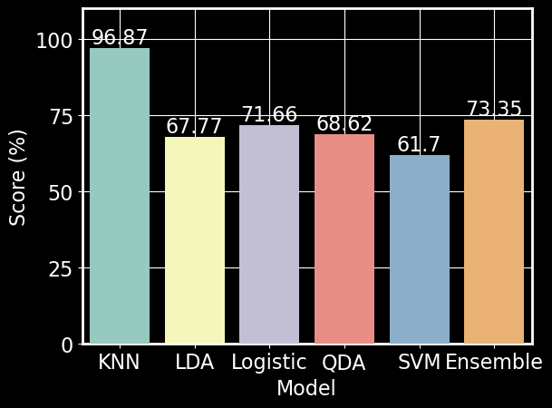

# What's covering me? - Prediction of forest cover type based on cartographic variables

Devin Austin and Duncan Tulimieri

Table of Contents

1. [Introduction](#introduction)

    1. [Previous literature using forest cover type data set](#previous-literature-using-forest-cover-type-data-set)
    
      1. [Blackard and Dean (1999)](#blackard-and-dean-1999)
      
      2. [Oza and Russell (2001)](#oza-and-russell-2001)
      
2. [Algorithms](#algorithms)

    1. [$$K$$-Nearest Neighbors ($$K$$NN)](#k-nearest-neighbors-knn)
  
    2. [Support Vector Machine (SVM)](#support-vector-machine-svm)
  
    3. [Linear Discriminant Analysis (LDA)](#linear-discriminant-analysis-lda)
  
    4. [Quadratic Discriminant Analysis (QDA)](#quadratic-discriminant-analysis-qda)
  
    5. [Logistic Regression (LR)](#logistic-regression-lr)
  
    6. [Ensemble Learning](#ensemble-learning)
  
3. [Results](#results)   

    1. [$$K$$-Nearest Neighbors](#k-nearest-neighbors)
  
    2. [Support Vector Machine](#support-vector-machine)
  
    3. [Linear Discriminant Analysis](#linear-discriminant-analysis)
  
    4. [Quadratic Discriminant Analysis](#quadratic-discriminant-analysis)
  
    5. [Logistic Regression](#logistic-regression)
  
    6. [Ensemble](#ensemble)
  
4. [Discussion](#discussion)

    1. [Moderate performers](#moderate-performers)
  
    2. [Strong performer](#strong-performer)
  
    3. [What happened with the ensemble model?](#what-happened-with-the-ensemble-model)
  
    4. [Future directions](#future-directions)
  
5. [Conclusion](#conclusion)

6. [Replication](#replication)

7. [Acknowledgements](#acknowledgements)

8. [References](#references)

---

# Introduction
National parks are some of the most beautiful places on this little blue planet we call home. They are some of the only remaining "untouched" regions of Earth that allow nature to flourish. These parks, while untouched, are not ignored. In fact, they are some of the most studied regions around the world.

The University of California Irvine's machine learning repository contains a large data set on the Roosevelt National Forest in northern Colorado. This data set -- known as the forest cover type data set -- is comprised of cartographic information from four parks within the Roosevelt National Forest (e.g Rawah, Comanche Peak, Neota, and Cache la Poudre) (Figure \ref{fig:loc_map}). The data set contains a variety of continuous and categorical features obtained from geological surveys; including elevation, soil type, slope, hill shade at various times of day, and distance to the nearest body of water. Along with these features, each instance has a forest cover type classification, which refers to the predominant tree species in a given 30x30 meter region (Figure \ref{fig:forest_cover_types}).

Current methods for classifying forest cover types involve direct observations via field personnel or estimation using remotely sensed data \cite{blackard1999comparative}. These approaches are often time-consuming and costly; however, the use of predictive models can streamline this process \cite{blackard1999comparative}. We decided to examine the accuracies of several machine learning algorithms and an ensemble learning method to predict forest cover types. Using these methods, our goal was to achieve the highest predictive power across all classes.

  

% blackard and dean - Location map 
\begin{figure}[!h]
    \centering
    \includegraphics[scale=0.4]{figures/BD99_location_map.png}
    \caption{Study area location map. Taken from Blackard and Dean (1999) \cite{blackard1999comparative}.}
    \label{fig:loc_map}
\end{figure}

\begin{figure}[!h] % add black outline and find summer! aspen picture
    \centering
    \includegraphics[scale=0.2]{figures/Forest_Covers_wbg.png}
    \caption{Forest cover types and predictors. The data set contains 581,012 instances, 54 predictors, and 7 classes. Examples of the seven cover type classifications can be seen in the pictures \cite{Spruce},\cite{Cottonwood},\cite{Krumholz},\cite{LodgepolePine},\cite{Aspen},\cite{PonderosaPine},\cite{DouglasFir}. A condensed list of predictors can be seen in bottom right. }
    \label{fig:forest_cover_types}
\end{figure}

## Previous literature using forest cover type data set
    
### Blackard and Dean (1999)
      
### Oza and Russell (2001)
      
# Algorithms

## $$K$$-Nearest Neighbors ($$K$$NN)
  
## Support Vector Machine (SVM)
  
## Linear Discriminant Analysis (LDA)
  
## Quadratic Discriminant Analysis (QDA)
  
## Logistic Regression (LR)
  
## Ensemble Learning
  
# Results  

## $$K$$-Nearest Neighbors
  
## Support Vector Machine
  
## Linear Discriminant Analysis
  
## Quadratic Discriminant Analysis
  
## Logistic Regression
  
## Ensemble
  
# Discussion

## Moderate performers
  
## Strong performer
  
## What happened with the ensemble model?
  
## Future directions
  
# Conclusion

# Replication

# Acknowledgements

# References
